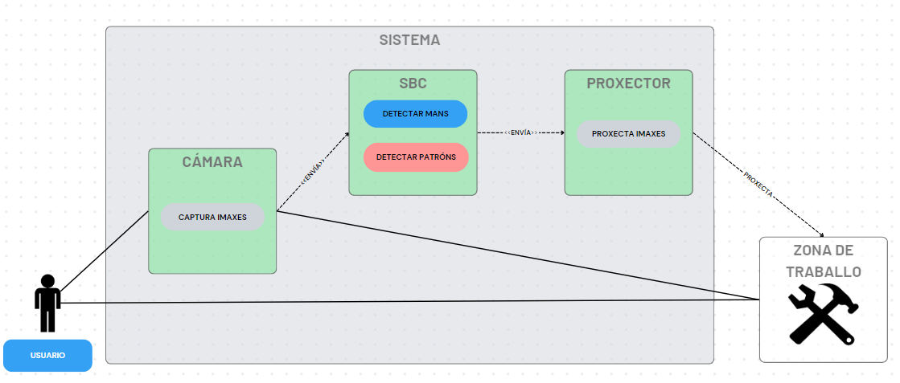

# iTeacher
Desenvolvemento dunha aplicación de realidade aumentada espacial para guiar usuarios na ensamblaxe dunha mesa

## Descripción
Como en todos os traballos, cada vez que se incorpora un novo integrante, requerimos dun
tempo e dun esforzo extra na correcta formación deste novo integrante. Isto conleva un gasto
de tempo extra para a empresa que moitas veces non é posible.
Para subsanar e reducir ese tempo de formación, proponse a creación dun sistema de Realidade
Aumentada Espacial (SAR, Spatial Augmented Reality), que contará cunha cámara e un proxector
que van conectados a un SBC (Single-Board Computer) (e.g., Raspberry Pi) que procesará os
datos que a cámara lle trasmite. O SBC detectará a secuencia de labores que ten que facer o
usuario, e co proxector mostraralle ao usuario os seguintes pasos que ten que levar a cabo. 
Deste xeito o usuario non necesitaría a priori que ninguén esté con el xa que o dispositivo
mostraralle de maneira visual e intuitiva onde e como facer o seu traballo.

Diagrama de uso:



Este proxecto tamén é válido para usar nun ordenador convencional, só se ten que indicar no programa main.py que non imos usar unha raspberry Pi para a execución.

## Instalación

1. Clona ó repositorio:
    ```bash
    git clone https://github.com/vidalmendeznicolas/iTeacher.git
    ```
2. Abrir un terminal de Python ou utiliza un IDE como Pycharm.
3. Executar main.py.

## Imaxe do prototipo


## Cambio no uso do dispositivo

O proxecto pode ser executado nunha Raspberry Pi ou nun ordenador convencional, para iso, no arquivo main.py temos que cambiar o valor de Raspi a True ou a False según necesitemos.